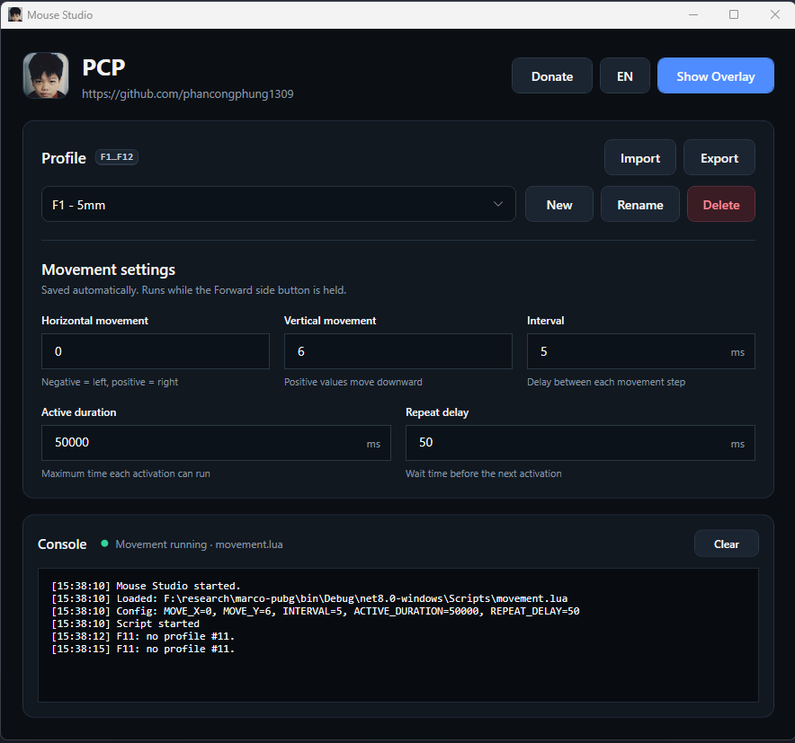

# Mouse Studio

A recoil-reduction tool for **PUBG: Battlegrounds** on Windows. While you fire, it pulls the mouse down to counter the gun's vertical recoil, so your aim stays on target without dragging the mouse yourself.

### No Logitech mouse? Don't worry, use this app.

Most recoil macros are Lua scripts for Logitech G Hub, so they only work with a Logitech mouse. Mouse Studio runs the same kind of Lua script for **any mouse**: Razer, SteelSeries, a no-name office mouse, whatever you have. No G Hub, no special driver, no extra software.

It does not read or change the game: it only moves the cursor, like a G Hub macro would. The moves come from Lua scripts, so the patterns can be tuned. G Hub scripts port over easily, since the script functions have the same names (`MoveMouseRelative`, `IsMouseButtonPressed`, `Sleep`, …).

> The mouse needs a Forward side button (most gaming mice have one): the pull-down is triggered by it.

### How it works

Hold the **Forward** side mouse button to fire and pull the cursor down by a fixed step at a fixed speed, all set by you. Save up to 12 profiles (for other guns, scopes or sensitivities) and switch between them in game with **F1 to F12**.

> **Warning:** using macros or recoil scripts is against the PUBG terms of service. Your account can be banned. Use at your own risk.

> **Built 100% with AI.** Every line of code in this project was written by AI through vibe coding. See [About this project](#about-this-project).



## Quick start (no install)

1. Download [Marco-Pubg.zip](https://github.com/phancongphung1309/marco-pubg/raw/main/Marco-Pubg.zip).
2. Extract it anywhere, for example to your Desktop. Keep all the files together: `MouseStudio.exe` needs the `Scripts` folder next to it.
3. Open the `Marco-Pubg` folder and double-click **`MouseStudio.exe`**.
4. Click **Yes** when Windows asks for administrator rights.
5. Pick a profile (or press **F1 to F12**), and start the game. Hold Forward to fire.

If Windows shows "Windows protected your PC", click **More info**, then **Run anyway**. The app is not signed, so Windows warns about it.

Nothing else is needed: .NET is built into the executable. Then see [How to use](#how-to-use).

## Build from source

### Requirements

- Windows 10 or 11 (64-bit)
- [.NET 8 SDK](https://dotnet.microsoft.com/download/dotnet/8.0), only to build from source
- Administrator rights: the app asks for them on start (`app.manifest`), so its hooks also work while an elevated game window has focus

### Build and run

```powershell
dotnet build MouseStudio.csproj
dotnet run --project MouseStudio.csproj
```

The scripts in `Scripts/` are copied next to the executable on build.

### Publish a single executable

```powershell
dotnet publish MouseStudio.csproj -c Release -r win-x64 --self-contained true `
  -p:PublishSingleFile=true -p:IncludeNativeLibrariesForSelfExtract=true `
  -p:EnableCompressionInSingleFile=true -p:DebugType=None -o Marco-Pubg
```

This writes `MouseStudio.exe` and the `Scripts` folder to `Marco-Pubg/`. Ship the whole folder.

### Tests

```powershell
dotnet test tests/MouseStudio.Tests
```

The xUnit tests cover profile data, name checks, and saving, loading, importing and exporting profiles.

## How to use

### 1. Start the app

Run `MouseStudio.exe` and accept the administrator prompt. Keep the `Scripts` folder next to the executable: the app runs the scripts in it.

On first start the app creates three profiles: **F1 - 5mm**, **F2 - 7mm** and **F3 - RPD**. The status line at the bottom turns green and reads `Movement running · movement.lua` once the script is running. The console under it shows what the app and the script are doing. There is no Start button: the script runs as long as the app is open.

### 2. Use Movement

1. Set the values in the Movement panel:

   | Setting | Meaning | Default |
   | --- | --- | --- |
   | Horizontal movement | Pixels moved right per step (negative moves left). Fractions such as `0.5` work: they add up across steps. | 0 |
   | Vertical movement | Pixels moved down per step (negative moves up) | 5 |
   | Interval | Delay between two steps, in ms (at least 1) | 10 |
   | Active duration | How long each drag lasts, in ms (at least 1) | 5000 |
   | Repeat delay | Pause before the next drag, in ms (0 or more) | 1000 |

   Changes are saved half a second after you stop typing, and the script reloads with them. An invalid value (empty, or out of range) is not saved: the console says why, and the last valid values stay in use.

2. **Hold the Forward side button** (button 5, the front thumb button) on the mouse. While it is held, the app:
   1. holds the left button down and moves the cursor by one step every Interval, for Active duration;
   2. releases the left button and waits Repeat delay;
   3. starts again from step 1.

3. **Release Forward** to stop at once. The left button is released too.

### 3. Manage profiles

Profiles let you keep several sets of Movement values and switch between them quickly. They are at the top of the settings panel:

- **New**: add a profile (up to 12). It starts with default values.
- **Rename**: change the name of the selected profile. Names must be unique.
- **Delete**: remove the selected profile, after a confirmation. The last profile cannot be deleted.
- **Drop-down list**: select the profile to use.
- **F1 to F12**: load the 1st to the 12th profile of the list, from anywhere, even while a game has focus. The order is the order of the list.

To back up profiles or move them to another PC:

- **Export** saves all profiles to a `.json` file.
- **Import** loads a `.json` file made by Export. The file is checked first; if it is valid, the app asks before it **replaces all current profiles** with the ones in the file.

Profiles are stored in `profiles.json` next to the executable.

### 4. Play with the overlay

Click **Show Overlay** before starting the game:

- A small always-on-top box shows the current profile.
- The main window is hidden to the notification area (tray).
- Drag the box with the left button to move it. Its position is remembered.
- Double-click the box, or click the tray icon, to bring the main window back.
- Right-click the tray icon for **Open Mouse Studio**, **Hide Overlay** and **Exit**.

Click **Hide Overlay** to close the box.

### Troubleshooting

- **Nothing happens in game**: make sure the app runs as administrator, and that the status line is green. Check the console for script errors.
- **`Lua script not found`**: the `Scripts` folder is missing next to `MouseStudio.exe`. Copy it back from the published folder.
- **A value will not save**: read the `Not saved:` line in the console; it names the field and the allowed range.
- **Wrong direction**: use negative values for Horizontal (left) or Vertical (up) movement.

## Scripts

A script defines `OnEvent(event, arg)`, which Mouse Studio calls with:

| Event | `arg` |
| --- | --- |
| `PROFILE_ACTIVATED` | `0`, when the script starts |
| `MOUSE_BUTTON_PRESSED` / `MOUSE_BUTTON_RELEASED` | The button: 1 left, 2 right, 4 back, 5 forward |
| `KEY_PRESSED` | The virtual-key code (F1 to F12 are kept for profile hotkeys) |

The profile's settings are set as globals before the script runs: `MOVE_X`, `MOVE_Y`, `INTERVAL`, `ACTIVE_DURATION`, and `REPEAT_DELAY`.

Functions available to scripts (`Core/Lua/LuaApi.cs`):

| Function | Description |
| --- | --- |
| `MoveMouseRelative(x, y)` | Move the cursor; fractions carry over to the next call |
| `PressMouseButton(b)` / `ReleaseMouseButton(b)` | Hold or release button 1 (left) or 2 (right) |
| `ClickMouseButton(b)` | Click button 1 or 2 |
| `IsMouseButtonPressed(b)` | Whether button 1, 2, 4 or 5 is held |
| `IsKeyLockOn(key)` | `"capslock"`, `"numlock"` or `"scrolllock"` |
| `Sleep(ms)` | Wait; ends early when the script is stopped |
| `GetTickCount()` | Milliseconds since Windows started |
| `OutputLogMessage(text)` | Write to the app console |

The app runs `Scripts/movement.lua`.

## Project layout

```
MainWindow.xaml(.cs)       Main window: profiles, settings, console
OverlayWindow.xaml(.cs)    Always-on-top status overlay
ProfileNameDialog.xaml     New / rename profile dialog
DonateWindow.xaml(.cs)     Donation QR code window
Core/Input/                Global mouse and keyboard hooks, mouse output
Core/Lua/                  Lua engine (NLua) and the script API
Core/Profiles/             Profile model and profiles.json storage
Scripts/                   Lua scripts copied next to the executable
tests/MouseStudio.Tests/   xUnit tests
```

## About this project

This project was built **100% with AI, by vibe coding**. No line of the code was typed by hand: the author described what they wanted in plain words, tried the result, and asked the AI for changes until the app worked the way they wanted.

The AI wrote all of it:

- the WPF app: windows, dark theme, overlay and tray icon;
- the low-level Windows mouse and keyboard hooks and the mouse output;
- the Lua engine and the script API, modelled on Logitech G Hub scripts;
- the profile storage, with import and export;
- the Lua pull-down script;
- the unit tests;
- this README.

The author's part was the idea, the requirements, testing it in game, tuning the values, and deciding what to keep.

### What this means for you

- **It works, but it was not reviewed line by line by a human developer.** Expect rough edges, and report bugs in the [issues](https://github.com/phancongphung1309/marco-pubg/issues).
- **The default profiles may not match your mouse sensitivity or scope.** Tune the values, or make your own profiles.
- **Read the code before you trust it**, as with any tool that runs as administrator and hooks your mouse and keyboard. It is all here, and it is short.

It is also an example of what vibe coding can build today: a working Windows desktop app with native hooks, a scripting engine and tests, made without writing code by hand.

## Support

If the app helps you, you can support the author: click **Donate** in the app to show the QR code (VietQR / Napas 247).
